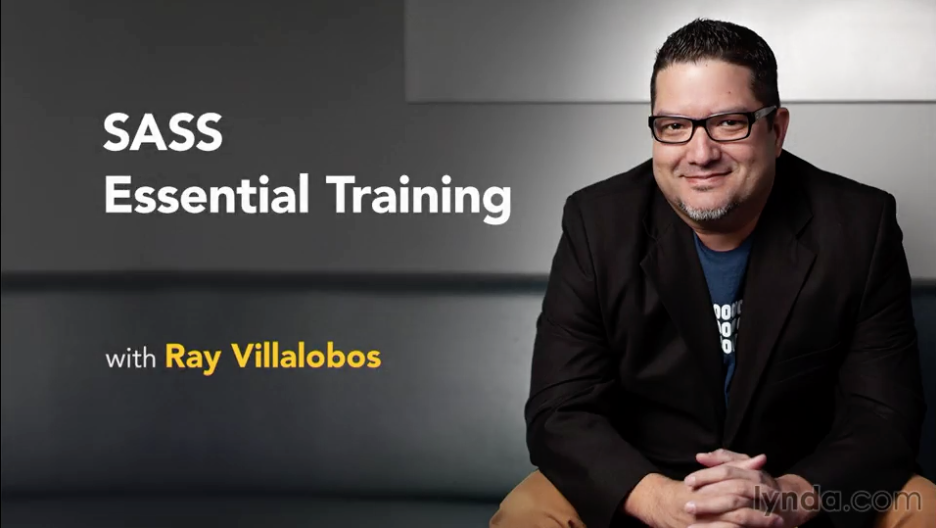

# Sass Essential Training
This is the repository for my course, [Sass Essential Training](http://www.lynda.com/Sass-tutorials/Sass-Essential-Training/375925-2.html) on [Lynda.com](http://lynda.com).

## Course Description
Learn the fundamentals of Syntactically Awesome Stylesheets (Sass), a modern web development language that helps you write CSS better, faster, and with more advanced features. Ray Villalobos shows you the best way to install Sass and work with its main features: variables, nesting, partials, and mixins. Plus, learn how to use SassScript to create complex functions from Sass lists and control statements.

## Topics include:
- Working with variables
- Nesting styles
- Creating mixins
- Conditional statements and loops in SassScript
- Extending your mixins
- Working with lists and maps

## Instructions
This repository has branches for each of the videos in the course. You can use the branch pop up menu in github to switch to a specific branch and take a look at the course at that stage. Or you can simply add `/tree/BRANCH_NAME` to the URL to go to the branch you want to peek at.

1. Make sure you have these installed
	- [node.js](http://nodejs.org/)
	- [git](http://git-scm.com/)
	- [gulp](http://gulpjs.com/)
	- [ruby](http://gulpjs.com/)

2. Clone this repository into your local machine using the terminal (mac) or Gitbash (PC) `> git clone https://github.com/planetoftheweb/sassEssentials.git`
3. CD to the folder `cd sassEssentials`
4. Run `> npm-install` to install the project dependencies
5. Install gulp.js via the Mac terminal or Gitbash on a PC `> npm install -g gulp`
5. Run the Gulp command `> gulp`

For more help setting up a comprehensive Gulp.js workflow, check out [Web Project Workflows with Gulp.js, Git, and Browserify](http://www.lynda.com/Web-Web-Design-tutorials/Web-Project-Workflows-Gulpjs-Git-Browserify/154416-2.html).

## More Stuff
Check out some of my [other courses on lynda.com](http://lynda.com/rayvillalobos). You can also check out my [youtube channel](http://youtube.com/planetoftheweb), [follow me on twitter](http://twitter.com/planetoftheweb), or read [my blog](http://raybo.org).
